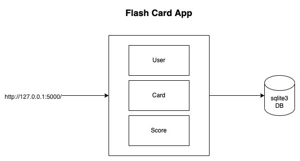
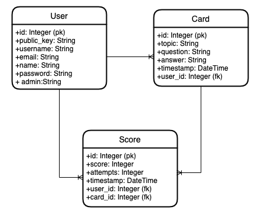
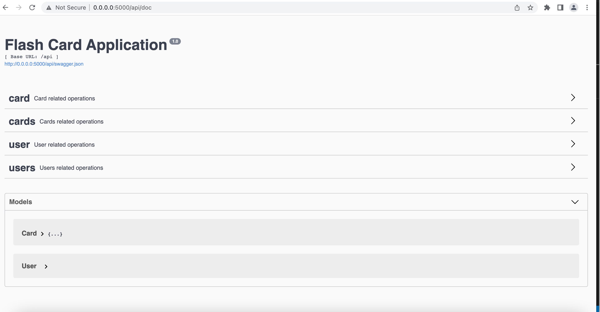

# Flash Cards Application using Flask

### Endpoint
> http://0.0.0.0:5001/api/doc

## Architecture Diagram

## ER Diagram

## Usage

### virtual environment

> python3 -m pip install virtualenv 
> 
> python3 -m virtualenv venv   
> 
> source venv/bin/activate

## Run the Application

> pip install -r requirements.txt
> 
> python app.py

This will start the application on port 5001

## Test the application

Swagger-UI can be used to test the application.

The server will start at <http://localhost:5001>.

## References

* [Flask-RESTPlus](https://flask-restplus.readthedocs.io/en/stable/index.html)
* [Flask-Marshmallow](https://flask-marshmallow.readthedocs.io/en/latest/)
* [Flask-SQLAlchemy](https://flask-sqlalchemy.palletsprojects.com/en/2.x/quickstart/)
